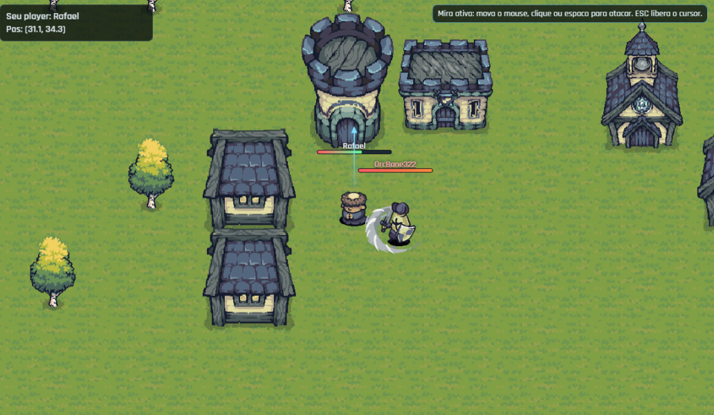

# RPG Peba MMO (Prototipo)

Monorepo de um prototipo MMO 2D realtime com:

- autenticacao JWT
- criacao de personagem (1 por conta)
- loop de jogo em tempo real com Socket.IO
- chat global com persistencia no banco
- editor de mapa com salvamento no banco
- backend em Fastify + Prisma (SQLite)
- frontend em React + Vite

## Tecnologias

- Backend: Node.js, Fastify, Socket.IO, Prisma, SQLite, JWT, Zod, TypeScript
- Frontend: React, Vite, socket.io-client, TypeScript
- Banco: SQLite via Prisma ORM

## Arquitetura geral

```
rpgPeba/
  backend/
    src/
      server.ts            # bootstrap HTTP + Socket.IO
      env.ts               # leitura de env e regras de CORS/origem
      routes/              # rotas HTTP (auth, character, world)
      socket.ts            # handshake JWT e eventos realtime
      realtime/            # loop de jogo, mundo online, chat, mapa, inimigos
    prisma/
      schema.prisma        # models do banco
      migrations/          # historico de migracoes
  frontend/
    src/
      App.tsx              # fluxo de login/sessao/ui principal
      api.ts               # cliente HTTP e URLs da API/WS
      socket.ts            # criacao do socket client
      game/
        useGameSocket.ts   # listeners e emissoes de eventos realtime
        GameCanvas.tsx     # render do mundo e controles
        MapEditor.tsx      # editor de mapa + upload de imagem
```

## Como instalar e rodar

### 1. Pre-requisitos

- Node.js 20+ (recomendado)
- npm 10+ (recomendado)

### 2. Instalar dependencias

Na raiz:

```bash
npm --prefix backend install
npm --prefix frontend install
```
ou

```bash
- cd backend 
- npm install

- cd frontend 
- npm install
```

### 3. Configurar `.env`

Crie os arquivos a partir dos exemplos:

```bash
copy backend\.env.example backend\.env
copy frontend\.env.example frontend\.env
```

No Linux/macOS:

```bash
cp backend/.env.example backend/.env
cp frontend/.env.example frontend/.env
```

### 4. Preparar banco de dados (obrigatorio)

Dentro de `backend/` rode:

```bash
npx prisma generate
npx prisma migrate dev --name init
```

Esses comandos sao obrigatorios para:

- gerar o Prisma Client usado pelo backend
- criar/atualizar o banco SQLite local com as tabelas do projeto

### 5. Subir backend e frontend

Use 2 terminais:

Terminal 1 (backend):

```bash
cd backend
npm run dev
```

Terminal 2 (frontend):

```bash
cd frontend
npm run dev
```

Tambem pode iniciar da raiz com:

```bash
npm run dev:backend
npm run dev:frontend
```

## Enderecos (localhost, LAN, Radmin)

### De onde o servidor puxa os enderecos

- Backend HTTP/Socket:
  - sobe com `host: 0.0.0.0` e `port: env.PORT` (`backend/src/server.ts`)
  - isso permite acesso por `localhost` e tambem por IP de rede (ex: `192.168.x.x`, `26.x.x.x`)
- Frontend Vite:
  - sobe com `host: 0.0.0.0` e `port: 5173` (`frontend/vite.config.ts`)
- Frontend -> Backend:
  - usa `VITE_API_URL` e `VITE_WS_URL` (`frontend/src/api.ts`)
- CORS no backend:
  - vem de `CORS_ORIGIN` em `backend/.env`
  - precisa conter as URLs do frontend que vao acessar a API (localhost, LAN, Radmin etc.)

### Exemplo para jogar pela rede Radmin

Se o IP Radmin da maquina do backend for `26.193.222.75`:

- `frontend/.env`:
  - `VITE_API_URL=http://26.193.222.75:3000`
  - `VITE_WS_URL=http://26.193.222.75:3000`
- `backend/.env`:
  - incluir `http://26.193.222.75:5173` no `CORS_ORIGIN`

## O que e um socket e como usamos Socket.IO

- Socket e uma conexao persistente cliente <-> servidor.
- Diferente de HTTP request/response isolado, o socket fica aberto e os dois lados trocam eventos continuamente.
- Socket.IO e a biblioteca usada para gerenciar essa conexao realtime com reconexao e eventos nomeados.

No projeto:

- cliente autentica via HTTP e recebe JWT
- cliente abre socket enviando o JWT no handshake (`auth.token`)
- backend valida o token no `io.use(...)`
- se estiver valido, registra o player online e comeca troca de eventos realtime

## Fluxo geral de funcionamento

1. Backend sobe com `npm run dev` dentro de `backend/`.
2. O servidor HTTP abre na porta `3000` (ou `PORT` do `.env`) e publica as rotas REST.
3. No mesmo processo, o Socket.IO tambem sobe e passa a gerenciar as chamadas/eventos realtime.
4. Usuario registra/loga (`/api/auth/register` ou `/api/auth/login`).
5. Backend devolve JWT.
6. Front chama `/api/auth/me` para restaurar sessao.
7. Front cria socket com esse token.
8. Backend autentica socket, carrega personagem e envia `session:ready`.
9. Front envia input (`player:move`, `atack`, `chat:send`).
10. Loop realtime (20 ticks/s) calcula movimento, ataques, IA de inimigos e emite `world:update`.
11. Posicoes/HP e chat sao persistidos no SQLite via Prisma.

## Rotas HTTP

- `GET /health`
  - health check do servidor
- `POST /api/auth/register`
  - cria conta e devolve JWT
- `POST /api/auth/login`
  - login e devolve JWT
- `GET /api/auth/me` (JWT)
  - dados da conta/sessao atual
- `POST /api/characters` (JWT)
  - cria personagem da conta
- `GET /api/characters/me` (JWT)
  - retorna personagem atual
- `POST /api/characters/me/inventory` (JWT)
  - atualiza slot do inventario
- `GET /api/world/state`
  - snapshot inicial do mundo
- `GET /api/world/map?mapKey=default`
  - carrega definicao de mapa
- `PUT /api/world/map` (JWT)
  - salva/atualiza mapa no banco
- `POST /api/map/image`
  - upload de imagem para assets do mapa
- `GET /images/world/*`
  - serve imagens do mapa salvas em `frontend/images/world`

## Eventos Socket.IO

Cliente -> Servidor:

- `player:move`
  - payload: `{ x: number; y: number }` (entre -1 e 1)
- `atack`
  - payload: `{ dirX: number; dirY: number; range?: number }`
- `chat:send`
  - payload: `{ text: string }`

Servidor -> Cliente:

- `session:ready`
  - payload: dados iniciais da sessao (`playerId`, `playerName`, `mapSize`)
- `world:update`
  - payload: estado do mundo (`players`, `enemies`, `attacks`, `tick`, `mapRevision`)
- `chat:history`
  - payload: ultimas mensagens carregadas do banco
- `chat:message`
  - payload: nova mensagem de chat em tempo real

## Banco de dados (Prisma)

Arquivo principal: `backend/prisma/schema.prisma`

Models atuais:

- `Account`
- `Character`
- `GameMap`
- `ChatMessage`

Comandos mais usados:

```bash
# dentro de backend/
npx prisma generate
npx prisma migrate dev --name init
```

## Observacoes sobre `.env`

- `backend/.env` e `frontend/.env` nao devem ir para git.
- Use sempre os `.env.example` como base (agora comentados).
- Se mudar IP/porta da API, atualize:
  - `frontend/.env` (`VITE_API_URL`, `VITE_WS_URL`)
  - `backend/.env` (`CORS_ORIGIN`, e `PORT` se necessario)
